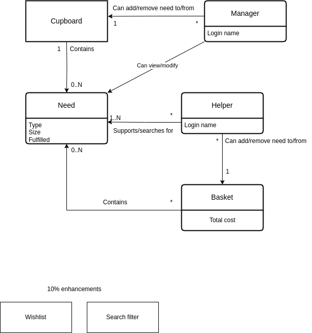
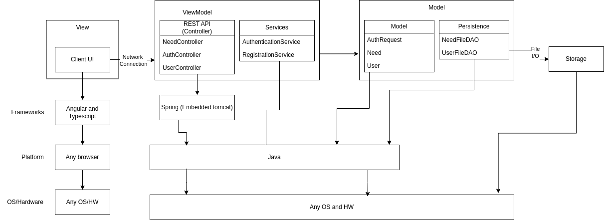
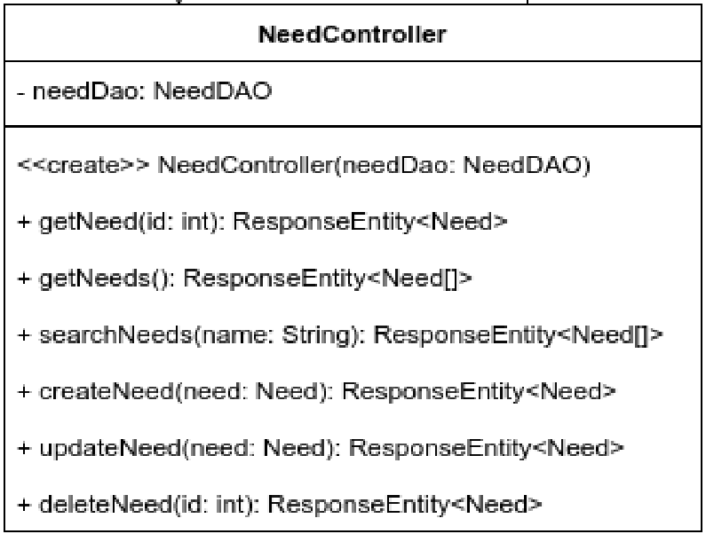
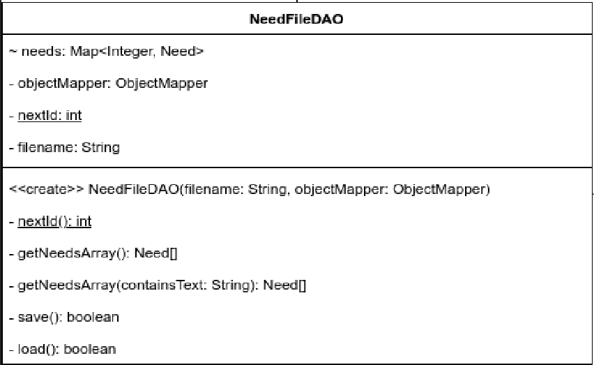

# PROJECT Design Documentation

## Team Information
* Team name: ChaosControl
* Team members
  * Owen
  * Jay
  * Ariel
  * Lila
  * Vlad

## Executive Summary

The project is a web-based application designed to support a Food Pantry that provides food to people in need.

This platform serves two user types: Managers (Admins) and Helpers. The Manager accounts, representing the organization (in our case, a ficticious company) have the ability to add, remove, and update needs. Helpers, representing volunteers within the organization, have the ability to search for and sign up for needs.

This workflow is optimized through a "basket" system, enabling Helpers to add multiple needs, review them, and commit to their schedule via a checkout process.

Key features include:
> TBD as our sprints continue.

 

### Purpose
>  _**[Sprint 2 & 4]** Provide a very brief statement about the project and the most
> important user group and user goals._

The purpose of this project is to create a web portal for a food bank that needs certain objectives fulfilled. The most important user group is the helpers who purchase needs for the organization. The goals of the helpers are to add needs to their funding baskets and buy the needs they add to support the food bank. 

### Glossary and Acronyms
> _**[Sprint 2 & 4]** Provide a table of terms and acronyms._

| Term | Definition |
|------|------------|
| SPA | Single Page |
| MVP | Minimum Viable Product|
| DAO | Data Access Object|
| MVVM | Model-View-ViewModel|

## Requirements

This section describes the features of the application.

> _In this section you do not need to be exhaustive and list every
> story.  Focus on top-level features from the Vision document and
> maybe Epics and critical Stories._

### Definition of MVP
> _**[Sprint 2 & 4]** Provide a simple description of the Minimum Viable Product._

The MVP will be an online portal for a food bank to request certain items to be purchased by helpers to restock the food bank. It will allow helpers to add needs to a funding basket and checkout with those needs to purchase them. It will also allow managers to manage a cupboard of needs by adding, removing, and modifying needs in the cupboard. 

### MVP Features
>  _**[Sprint 4]** Provide a list of top-level Epics and/or Stories of the MVP._

### Enhancements
> _**[Sprint 4]** Describe what enhancements you have implemented for the project._

## Application Domain

This section describes the application domain.

> _**[Sprint 2 & 4]** Provide a high-level overview of the domain for this application. You
> can discuss the more important domain entities and their relationship
> to each other._

## Architecture and Design

This application uses a REST API to keep track of all user information and needs information. The API uses an Angular user interface, providing both a helper and manager view.

### Summary

The following Tiers/Layers model shows a high-level view of the webapp's architecture. 
**NOTE**: detailed diagrams are required in later sections of this document.

The web application, is built using the Model–View–ViewModel (MVVM) architecture pattern. 

The Model stores the application data objects including any functionality to provide persistance. 

The View is the client-side SPA built with Angular utilizing HTML, CSS and TypeScript. The ViewModel provides RESTful APIs to the client (View) as well as any logic required to manipulate the data objects from the Model.

Both the ViewModel and Model are built using Java and Spring Framework. Details of the components within these tiers are supplied below.

### Overview of User Interface

This section describes the web interface flow; this is how the user views and interacts with the web application.

> _Provide a summary of the application's user interface.  Describe, from the user's perspective, the flow of the pages/navigation in the web application.
>  (Add low-fidelity mockups prior to initiating your **[Sprint 2]**  work so you have a good idea of the user interactions.) Eventually replace with representative screen shots of your high-fidelity results as these become available and finally include future recommendations improvement recommendations for your **[Sprint 4]** )_

When a user navigates to the site, they are greeted with a login prompt. They can either choose to log in with a username and password, or register as a new user. Once logged in, they will see the need cupboard for the organization where they can click on needs to view their details such as name, price, and the food group they belong to. When viewing the need as a helper, there will be options to return to the cupboard, or add the need to their funding basket. As a manager, they will have the options to return to the cupboard, or remove the need from the cupboard. 

### View Tier
> _**[Sprint 4]** Provide a summary of the View Tier UI of your architecture.
> Describe the types of components in the tier and describe their
> responsibilities.  This should be a narrative description, i.e. it has
> a flow or "story line" that the reader can follow._

> _**[Sprint 4]** You must  provide at least **2 sequence diagrams** as is relevant to a particular aspects 
> of the design that you are describing.  (**For example**, in a shopping experience application you might create a 
> sequence diagram of a customer searching for an item and adding to their cart.)
> As these can span multiple tiers, be sure to include an relevant HTTP requests from the client-side to the server-side 
> to help illustrate the end-to-end flow._

> _**[Sprint 4]** To adequately show your system, you will need to present the **class diagrams** where relevant in your design. Some additional tips:_
 >* _Class diagrams only apply to the **ViewModel** and **Model** Tier_
>* _A single class diagram of the entire system will not be effective. You may start with one, but will be need to break it down into smaller sections to account for requirements of each of the Tier static models below._
 >* _Correct labeling of relationships with proper notation for the relationship type, multiplicities, and navigation information will be important._
 >* _Include other details such as attributes and method signatures that you think are needed to support the level of detail in your discussion._

### ViewModel Tier

The ViewModel tier provides the application’s interface for client interaction and business logic, bridging the model (data) with the controller (API endpoints):

	1.	Controllers:
	•	NeedController handles HTTP requests related to Need entities.
	•	It uses REST endpoints (GET, POST, PUT, DELETE) for CRUD operations and return appropriate ResponseEntity objects, managing HTTP status codes based on the success or failure of each operation.

> _**[Sprint 4]** Provide a summary of this tier of your architecture. This
> section will follow the same instructions that are given for the View
> Tier above._

> _At appropriate places as part of this narrative provide **one** or more updated and **properly labeled**
> static models (UML class diagrams) with some details such as associations (connections) between classes, and critical attributes and methods. (**Be sure** to revisit the Static **UML Review Sheet** to ensure your class diagrams are using correct format and syntax.)_
> 

### Model Tier
The model tier provides the interface for business logic and persistence. This bridges the gap between storage and the model. 

	1.	Data Access Objects:
	• NeedFileDAO provides the methods for interacting with the storage. 
	• There are methods to support creating, reading, updating, and deleting needs from storage.

> _**[Sprint 2, 3 & 4]** Provide a summary of this tier of your architecture. This
> section will follow the same instructions that are given for the View
> Tier above._
> _At appropriate places as part of this narrative provide **one** or more updated and **properly labeled**
> static models (UML class diagrams) with some details such as associations (connections) between classes, and critical attributes and methods. (**Be sure** to revisit the Static **UML Review Sheet** to ensure your class diagrams are using correct format and syntax.)_
> 

## OO Design Principles

### Abstraction
We have applied abstraction in our design by creating an interface for our data access object that our controller uses for file I/O operations.
### Low Coupling
Low coupling was applied in our design by utilizing dependency injection in our NeedController class. Instead of instantiating a NeedDAO in NeedController, we pass one in through it's constructor. 
### Encapsulation
We applied encapsulation in our design by grouping related methods and data into classes. The Need class has methods and data needed to represent the state and behavior of a need, for example. 

> _**[Sprint 2, 3 & 4]** Will eventually address upto **4 key OO Principles** in your final design. Follow guidance in augmenting those completed in previous Sprints as indicated to you by instructor. Be sure to include any diagrams (or clearly refer to ones elsewhere in your Tier sections above) to support your claims._

> _**[Sprint 3 & 4]** OO Design Principles should span across **all tiers.**_

## Static Code Analysis/Future Design Improvements
> _**[Sprint 4]** With the results from the Static Code Analysis exercise, 
> **Identify 3-4** areas within your code that have been flagged by the Static Code 
> Analysis Tool (SonarQube) and provide your analysis and recommendations.  
> Include any relevant screenshot(s) with each area._

> _**[Sprint 4]** Discuss **future** refactoring and other design improvements your team would explore if the team had additional time._

## Testing
> _This section will provide information about the testing performed
> and the results of the testing._

### Acceptance Testing
> _**[Sprint 2 & 4]** Report on the number of user stories that have passed all their
> acceptance criteria tests, the number that have some acceptance
> criteria tests failing, and the number of user stories that
> have not had any testing yet. Highlight the issues found during
> acceptance testing and if there are any concerns._

### Unit Testing and Code Coverage
> _**[Sprint 4]** Discuss your unit testing strategy. Report on the code coverage
> achieved from unit testing of the code base. Discuss the team's
> coverage targets, why you selected those values, and how well your
> code coverage met your targets._

>_**[Sprint 2, 3 & 4]** **Include images of your code coverage report.** If there are any anomalies, discuss
> those._

## Ongoing Rationale
>_**[Sprint 1, 2, 3 & 4]** Throughout the project, provide a time stamp **(yyyy/mm/dd): Sprint # and description** of any _**mayor**_ team decisions or design milestones/changes and corresponding justification._

## Sprint 1
- **2025-02-02**: - Implementation of design from Heroes API base.
- **2025-02-23**: Changed base meeting dates to Tuesdays [5:00pm-6:00pm] and Fridays [3:00pm-4:30pm]

## Sprint 2
> Currently In Progress

## Sprint 3
- N/A
## Sprint 4
- N/A